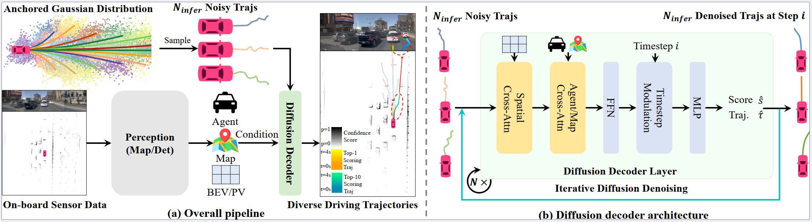
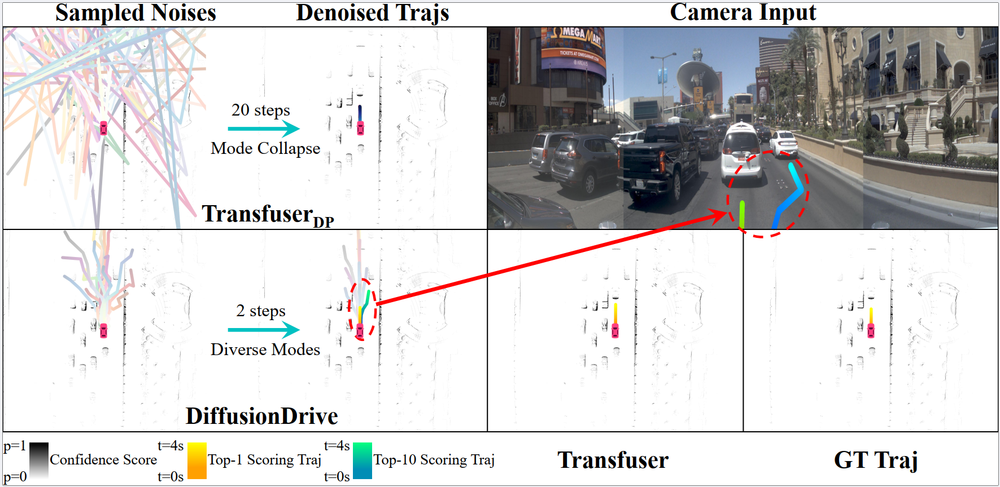
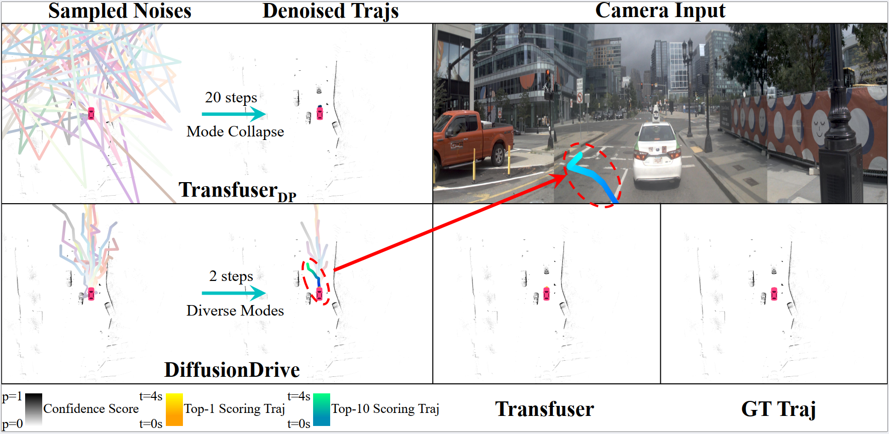
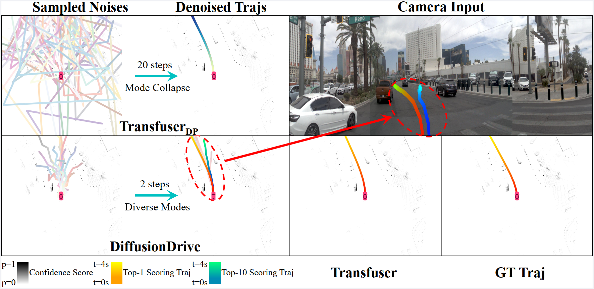
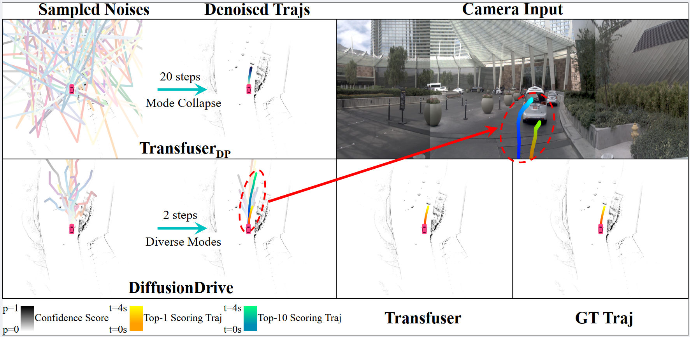

<div align="center">

<h1>DiffusionDrive</h1>
<h3>Truncated Diffusion Model for End-to-End Autonomous Driving</h3>

[Bencheng Liao](https://github.com/LegendBC)<sup>1,2</sup>, [Shaoyu Chen](https://scholar.google.com/citations?user=PIeNN2gAAAAJ&hl=en&oi=sra)<sup>2,3</sup>, Haoran Yin<sup>3</sup>, [Bo Jiang](https://scholar.google.com/citations?user=UlDxGP0AAAAJ&hl=en)<sup>2</sup>, [Cheng Wang](https://scholar.google.com/citations?user=PdJIyPIAAAAJ&hl=zh-CN)<sup>1,2</sup>, [Sixu Yan](https://github.com/Yansixu/)<sup>2</sup>, Xinbang Zhang<sup>3</sup>, Xiangyu Li<sup>3</sup>, Ying Zhang<sup>3</sup>, [Qian Zhang](https://scholar.google.com/citations?user=pCY-bikAAAAJ&hl=zh-CN)<sup>3</sup>, [Xinggang Wang](https://xwcv.github.io)<sup>2 :email:</sup>
 
<sup>1</sup> Institute of Artificial Intelligence, HUST, <sup>2</sup> School of EIC, HUST, <sup>3</sup> Horizon Robotics

(<sup>:email:</sup>) corresponding author, xgwang@hust.edu.cn


[](https://arxiv.org/abs/2411.15139)&nbsp;
[](https://huggingface.co/hustvl/DiffusionDrive)&nbsp;


</div>

## News
* **` Jan. 18th, 2025`:** We release the initial version of code and weight on nuScenes, along with documentation and training/evaluation scripts. Please run `git checkout nusc` to use it.
* **` Dec. 16th, 2024`:** We release the initial version of code and weight on NAVSIM, along with documentation and training/evaluation scripts.
* **` Nov. 25th, 2024`:** We released our paper on [Arxiv](https://arxiv.org/abs/2411.15139). Code/Models are coming soon. Please stay tuned! ☕️


## Table of Contents
- [Introduction](#introduction)
- [Qualitative Results on NAVSIM Navtest Split](#qualitative-results-on-navsim-navtest-split)
- [Video Demo on Real-world Application](#video-demo-on-real-world-application)
- [Getting Started](#getting-started)
- [Contact](#contact)
- [Acknowledgement](#acknowledgement)
- [Citation](#citation)

## Introduction
Diffusion policy exhibits promising multimodal property and distributional expressivity in robotic field, while not ready for real-time end-to-end autonomous driving in more dynamic and open-world traffic scenes. To bridge this gap, we propose a novel truncated diffusion model, DiffusionDrive, for real-time end-to-end autonomous driving, which is much faster (10x reduction in diffusion denoising steps), more accurate (3.5 higher PDMS on NAVSIM), and more diverse (64% higher mode diversity score) than the vanilla diffusion policy. Without bells and whistles, DiffusionDrive achieves record-breaking 88.1 PDMS on NAVSIM benchmark with the same ResNet-34 backbone by directly learning from human demonstrations, while running at a real-time speed of 45 FPS.

<div align="center"><b>Truncated Diffusion Policy.</b>

<b>Pipeline of DiffusionDrive. DiffusionDrive is highly flexible to integrate with onboard sensor data and existing perception modules.</b>

</div>

## Qualitative Results on NAVSIM Navtest Split
<div align="center">
<b>Going straight with car-following and lane-changing behaviors.</b>

<b>Going straight with diverse lane-changing behavior, which interacts with traffic light and stops at the stop line.</b>

<b>Turning left with diverse lane-changing behavior, which interacts with surrounding agents.</b>

<b>Turning right with car-following and overtaking behaviors.</b>

</div>

## Video Demo on Real-world Application


https://github.com/user-attachments/assets/bd2364f3-73fd-4c29-b8b2-ead11f78926d


## Getting Started

- [Getting started from NAVSIM environment preparation](https://github.com/autonomousvision/navsim?tab=readme-ov-file#getting-started-)
- [Preparation of DiffusionDrive environment](docs/install.md)
- [Training and Evaluation](docs/train_eval.md)


## Checkpoint

> Results on NAVSIM


| Method | Model Size | Backbone | PDMS | Weight Download |
| :---: | :---: | :---: | :---:  | :---: |
| DiffusionDrive | 60M | [ResNet-34](https://huggingface.co/timm/resnet34.a1_in1k) | [88.1](https://github.com/hustvl/DiffusionDrive/releases/download/DiffusionDrive_88p1_PDMS_Eval_file/diffusiondrive_88p1_PDMS.csv) | [Hugging Face](https://huggingface.co/hustvl/DiffusionDrive) |

> Results on nuScenes


| Method | Backbone | Weight | Log | L2 (m) 1s | L2 (m) 2s | L2 (m) 3s | L2 (m) Avg | Col. (%) 1s | Col. (%) 2s | Col. (%) 3s | Col. (%) Avg |
| :---: | :---: | :---: | :---: | :---: | :---: | :---:| :---: | :---: | :---: | :---: | :---: |
| DiffusionDrive | ResNet-50 | [HF](https://huggingface.co/hustvl/DiffusionDrive) | [Github](https://github.com/hustvl/DiffusionDrive/releases/download/DiffusionDrive_nuScenes/diffusiondrive_stage2.log.log) |  0.27 | 0.54  | 0.90 |0.57 | 0.03  | 0.05 | 0.16 | 0.08  |


## Contact
If you have any questions, please contact [Bencheng Liao](https://github.com/LegendBC) via email (bcliao@hust.edu.cn).

## Acknowledgement
DiffusionDrive is greatly inspired by the following outstanding contributions to the open-source community: [NAVSIM](https://github.com/autonomousvision/navsim), [Transfuser](https://github.com/autonomousvision/transfuser), [Diffusion Policy](https://github.com/real-stanford/diffusion_policy), [MapTR](https://github.com/hustvl/MapTR), [VAD](https://github.com/hustvl/VAD), [SparseDrive](https://github.com/swc-17/SparseDrive).

## Citation
If you find DiffusionDrive is useful in your research or applications, please consider giving us a star 🌟 and citing it by the following BibTeX entry.

```bibtex
 @article{diffusiondrive,
  title={DiffusionDrive: Truncated Diffusion Model for End-to-End Autonomous Driving},
  author={Bencheng Liao and Shaoyu Chen and Haoran Yin and Bo Jiang and Cheng Wang and Sixu Yan and Xinbang Zhang and Xiangyu Li and Ying Zhang and Qian Zhang and Xinggang Wang},
  journal={arXiv preprint arXiv:2411.15139},
  year={2024}
}
```
